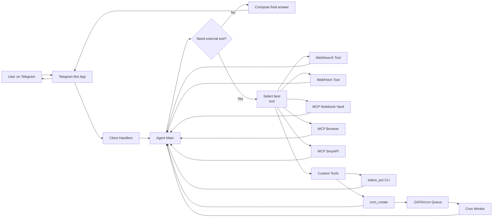
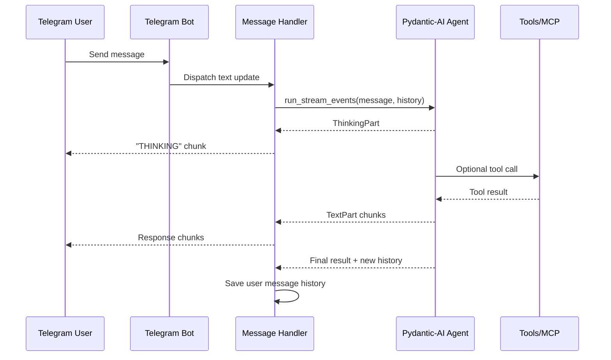

---
title:
  "Building My Personal Telegram AI Agent: A Practical, Tool-Using Assistant"
date: 2026-04-26
keywords:
  - agent
  - ai
  - ai-agent
  - automation
  - bot
  - cron
  - gemma
  - llm
  - mcp
  - model-context-protocol
  - personal-assistant
  - pydantic
  - pydantic-ai
  - python
  - python-telegram-bot
  - scheduling
  - serpapi
  - telegram
  - telegram-bot
  - tool-calling
  - web-search
---

I wanted an assistant that could do more than chat. I wanted one that could run
useful tools, remember context, automate scheduled tasks, and stay close to my
real workflow.

---

So I built this project: a personal Telegram-based AI agent powered by
`pydantic-ai`, a Google model, and a focused Python architecture.

> **Source Code**: You can find the complete project repository on GitHub at
> [alaminkouser/agent](https://github.com/alaminkouser/agent).

This post walks through what I built, why I designed it this way, and what makes
it portfolio-worthy.

## Project Goal

The goal was simple: create a reliable personal AI operator that I can message
from Telegram and use for real tasks, not demos.

The bot can:

- respond conversationally with streamed output
- use web search and web fetch tools
- call MCP toolsets (notebook vault, browser automation, SerpAPI MCP)
- update my public website status via a custom tool
- schedule future tasks through a cron-style file queue

In short, this is an AI assistant with action capability, not just text
generation.

## High-Level Architecture

The system is intentionally modular:

- `app/main.py` boots a Telegram bot, registers handlers, and launches a cron
  worker thread
- `app/client/*` handles Telegram interaction (`/start`, text messages,
  authorization, message formatting)
- `app/agents/main.py` builds the core AI agent with model, instructions, tools,
  and capabilities
- `app/agents/tools/*` contains focused tools (`status_put`, `cron_create`,
  `current_datetime`)
- `app/cron/worker.py` runs due scheduled tasks from `.DATA/cron` and sends
  results back to Telegram

This separation keeps transport (Telegram), reasoning (agent), and automation
(cron/jobs) loosely coupled and easy to extend.

## Why Telegram as the Interface?

Telegram gives me:

- instant availability from phone and desktop
- async interaction without building a custom frontend
- straightforward bot integration with `python-telegram-bot`
- a clean command + chat model for agent workflows

For a personal operator, Telegram is the fastest route to daily usability.

## AI Layer: `pydantic-ai` + Tool-First Design

The core agent is created in `agent_main()` with:

- a Google-hosted model (`gemma-4-26b-a4b-it`)
- templated instructions (Jinja2)
- built-in tools (`WebSearchTool`, `WebFetchTool`)
- MCP toolsets for notebook, browser control, and search
- skill directories via `SkillsCapability`

I chose a tool-first architecture so the model can decide **when** to call
utilities and external systems rather than forcing brittle hardcoded flows.

## Streaming Events for Better UX

Instead of waiting for one final response, the bot streams agent events and
displays progress in chunks:

- thinking segments
- tool-call events
- text outputs
- final message history updates for continuity

This makes interactions feel alive and transparent. Users can see when the
assistant is reasoning versus executing.

## Scheduled Automation with a File-Based Cron Queue

One of my favorite parts is the scheduled task system.

The `cron_create` tool writes jobs into `.DATA/cron` as timestamped files.  
The background worker continuously checks this directory, runs due tasks through
the same agent pipeline, and delivers results to Telegram.

Why this approach works well:

- no external queue dependency
- easy to inspect/debug manually
- durable enough for personal automation
- trivial to backup and migrate

It is simple infrastructure with practical power.

## Real-World Utility: Website Status Updates

The `status_put` tool bridges AI and personal branding.  
From chat, I can set a concise status shown on my website
(`alaminkouser.com/status`) through a dedicated CLI command.

This is a good example of “small feature, high leverage”: tiny code footprint,
immediate day-to-day value.

## Reliability and Safety Choices

A few implementation choices help keep the system reliable:

- user restriction middleware ensures only my Telegram user can interact with
  the bot
- environment-driven secrets (`.env`) keep tokens and keys out of code
- startup notification ("BOT IS ONLINE") confirms the service is healthy
- markdown chunking + media-aware messaging prevents Telegram length/format
  issues
- exception handling returns visible errors instead of silent failures

These are not flashy features, but they make the assistant trustworthy in real
use.

## Tech Stack

- Python
- `pydantic-ai-slim[google]`
- `python-telegram-bot`
- `pydantic-ai-skills`
- `Jinja2`
- `telegramify-markdown[mermaid]`
- `python-dotenv`
- `logfire`

## Challenges I Solved

### 1) Turning model output into chat-safe content

Raw model responses are not always Telegram-ready. I used `telegramify-markdown`
to split long content and support rich output types (text, photo, file) in a
unified path.

### 2) Keeping context between messages

I persist message history per user session so the assistant can continue
conversations naturally across turns.

### 3) Mixing synchronous and async runtime concerns

The bot runs polling while a cron worker runs in parallel. I handled this with a
separate daemon thread that runs an async worker loop.

## What I Learned

This project reinforced an important engineering lesson:

**use simple, composable pieces to build powerful systems.**

I did not need a massive platform. A clean Telegram client layer, a capable
tool-using agent core, and a small scheduler gave me a personal AI system that
is genuinely useful.

## What’s Next

Planned improvements:

- stronger observability and structured run tracing
- retries/backoff around external tool calls
- richer scheduling controls (update/cancel/list jobs)
- better prompt and tool auditing for long-term reliability
- optional multi-user mode with proper auth and per-user memory

## Final Thoughts

This is one of those projects where practical usefulness and technical depth
meet nicely.  
It demonstrates applied LLM engineering, tool orchestration, agent UX design,
and production-minded constraints in a compact codebase.

If you are building portfolio projects, this pattern is a strong one:  
**pick a real personal workflow, then build an AI system that actually improves
it.**
