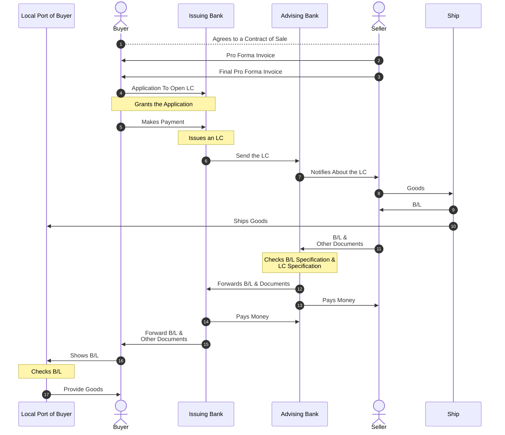

A Letter of Credit (LC) is a financial instrument used in international trade to
ensure secure payment between a buyer and a seller. Banks act as intermediaries,
guaranteeing payment to the seller upon successful fulfillment of agreed
conditions and submission of compliant documents.

---

## Parties Involved

- **Buyer** - The importer who initiates the LC
- **Seller** - The exporter who supplies goods
- **Issuing Bank** - The buyer's bank that issues the LC
- **Advising Bank** - The seller's bank that verifies and communicates the LC
- **Shipping Entity (Ship)** - Responsible for transporting goods
- **Local Port of Buyer** - Final delivery point for goods

## Process Description

The Letter of Credit process begins when the buyer and seller agree on a
contract of sale. The seller first issues a **pro forma invoice** and later a
final version confirming all trade terms.

Following this, the buyer applies to the issuing bank to open a Letter of
Credit. Once the bank reviews and approves the application, it formally issues
the LC and sends it to the advising bank, typically located in the seller's
country. The advising bank verifies the authenticity of the LC and notifies the
seller.

After receiving confirmation, the seller proceeds to ship the goods through a
carrier. The shipping company issues a **Bill of Lading (B/L)**, which serves as
proof that the goods have been dispatched.

The seller then submits the B/L along with other required documents to the
advising bank. The advising bank carefully checks these documents to ensure they
comply with the terms and conditions specified in the LC. If everything is in
order, the documents are forwarded to the issuing bank.

Once the documents are verified, the advising bank pays the seller. The issuing
bank subsequently reimburses the advising bank and sends the shipping documents
to the buyer.

Finally, the buyer presents the Bill of Lading at the local port to claim the
goods. After verification by port authorities, the goods are released to the
buyer.

## Process Flow Diagram

## Key Documents

- **Pro Forma Invoice**
- **Final Invoice**
- **Letter of Credit (LC)**
- **Bill of Lading (B/L)**
- **Supporting Trade Documents**

## Benefits of Letter of Credit

### For the Seller

- Guaranteed payment from a bank
- Reduced risk of non-payment

### For the Buyer

- Payment made only after shipment proof
- Assurance that goods are dispatched as agreed
