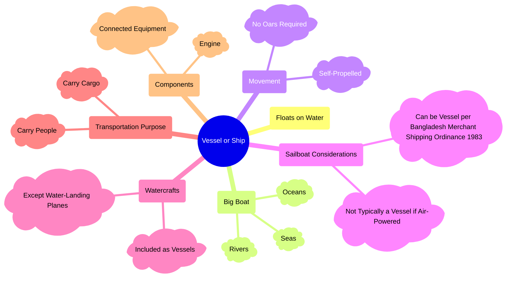

The concept of a vessel in Bangladesh encompasses more than a floating
structure, integrating physical characteristics, propulsion systems, functional
use, and legal recognition. A vessel is generally defined as a watercraft
capable of floating and navigating rivers, seas, and oceans, primarily for the
transportation of people or cargo. The classification includes self-propelled
crafts and various watercraft, while excluding exceptions such as water-landing
planes. Special consideration is given to sailboats, which may be recognized as
vessels under the Merchant Shipping Ordinance of 1983 despite their wind-based
propulsion. Overall, the definition reflects a comprehensive approach that
combines technical features and legal frameworks to determine the status of
traditional vessels in Bangladesh.

---

## Introduction

In Bangladesh, the definition of a vessel or ship goes beyond the idea of a
simple floating object. It involves a combination of structural features,
navigation ability, propulsion systems, and legal recognition. A vessel is
generally any structure capable of floating on water and used for transportation
across rivers, seas, and oceans.

## Flotation and Physical Characteristics

A fundamental requirement of a vessel is its ability to float on water. This
characteristic distinguishes vessels from other types of transport. In the
context of Bangladesh, traditional vessels often operate in rivers, but the
definition also includes those capable of navigating seas and oceans. These
vessels are typically large boats designed for stability and endurance in
different water conditions.

## Movement and Propulsion

Movement is another essential factor in defining a vessel. Unlike small manually
operated boats, vessels are generally not dependent on oars. Instead, they are
self-propelled through engines or mechanical systems. This self-propulsion
ensures efficiency, long-distance travel capability, and independence in
navigation.

## Scope of Watercraft

The definition of a vessel broadly includes various types of watercraft. Any
craft used on water for transportation purposes, whether carrying passengers or
cargo can be classified as a vessel. However, exceptions exist. Water-landing
planes, despite their interaction with water, are excluded because their primary
function is aerial navigation rather than maritime operation.

## Sailboat Considerations

Sailboats present a unique case in vessel classification. Since they rely on
wind power, they are not always considered vessels in a strict technical sense.
However, under the Merchant Shipping Ordinance of 1983 in Bangladesh, sailboats
may be legally recognized as vessels. This demonstrates how legal frameworks
influence classification beyond physical and mechanical characteristics.

## Purpose of Transportation

A vessel must serve a transportation purpose. This includes carrying people,
transporting goods, or facilitating trade and travel. The role of vessels in
Bangladesh is especially significant due to the country's extensive river
network, making them vital for both economic and social activities.

## Components and Equipment

A vessel is not just a floating body; it includes essential components that
enable its operation. These include engines, navigation systems, and connected
equipment. Such components ensure safe movement, control, and functionality
during voyages.

## Structural Overview of Vessel Definition

Below is a visual representation summarizing the scope and definition of a
vessel in Bangladesh:

## Conclusion

The definition of a traditional vessel in Bangladesh is comprehensive and
multifaceted. It incorporates flotation, propulsion, transportation purpose, and
legal recognition. By considering all these elements, Bangladesh ensures a clear
and functional classification system for vessels operating within its waterways
and maritime boundaries.
