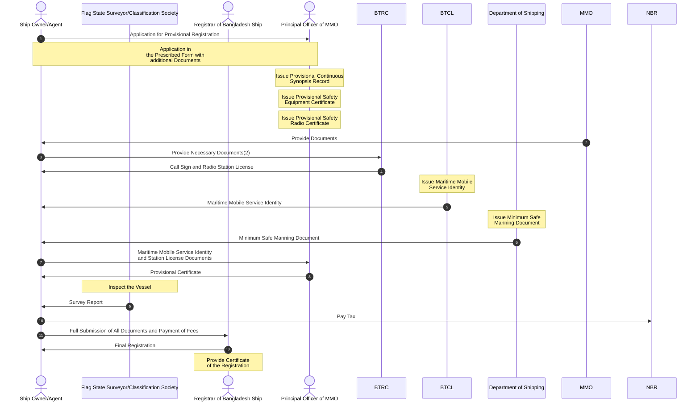

The ship registration process in Bangladesh involves a multi-step procedure that
includes provisional registration, inspection, regulatory approvals, and final
certification. It requires coordination between several authorities such as the
Mercantile Marine Office, BTRC, BTCL, Department of Shipping, and the Registrar
of Bangladesh Ship. The process ensures that vessels meet safety, communication,
and legal requirements before receiving the Certificate of Registration,
enabling them to operate under the national flag.

---

## Introduction

The ship registration process in Bangladesh is a structured legal and
administrative procedure that ensures vessels are properly documented,
inspected, and authorized to operate under the national flag. This process
involves multiple regulatory authorities and requires the submission of various
documents, inspections, and compliance with maritime regulations.

## Key Authorities Involved

Several organizations play essential roles in the registration process. The
Principal Officer of the Mercantile Marine Office (MMO) oversees provisional
registration and initial certification. The Bangladesh Telecommunication
Regulatory Commission (BTRC) and Bangladesh Telecommunications Company Limited
(BTCL) handle communication-related licensing and identification. The Department
of Shipping ensures compliance with manning requirements, while the National
Board of Revenue (NBR) manages taxation. Final registration is completed by the
Registrar of Bangladesh Ship, with support from classification societies or flag
state surveyors for vessel inspection.

## Provisional Registration Process

The process begins with the Ship Owner or Agent submitting an application for
provisional registration to the Principal Officer of the MMO. This application
must be in the prescribed form along with supporting documents. Upon review, the
MMO issues several provisional documents, including the Continuous Synopsis
Record, Safety Equipment Certificate, and Safety Radio Certificate.

Following this, the Ship Owner or Agent obtains necessary communication
credentials. This includes applying to BTRC for a call sign and radio station
license, and to BTCL for a Maritime Mobile Service Identity. Additionally, the
Department of Shipping issues the Minimum Safe Manning Document, ensuring that
the vessel meets crew requirements.

## Inspection and Compliance

Once provisional documentation is in place, the vessel undergoes inspection by a
Flag State Surveyor or a Classification Society. This inspection verifies the
vessel's seaworthiness and compliance with safety and technical standards. A
survey report is then issued, which is a critical requirement for final
registration.

## Financial and Legal Formalities

Before final registration, the Ship Owner or Agent must fulfill financial
obligations, including the payment of applicable taxes to the National Board of
Revenue (NBR). All required documents, along with proof of payment and
inspection reports, must then be submitted to the Registrar of Bangladesh Ship.

## Sequence Overview

The following diagram illustrates the complete sequence of interactions and
document flow during the ship registration process in Bangladesh:

## Final Registration

After successful submission and verification of all documents, the Registrar of
Bangladesh Ship completes the registration process. A Certificate of
Registration is issued, officially recognizing the vessel under the Bangladesh
flag. This final step confirms that the ship complies with all legal, technical,
and operational requirements.

## Conclusion

The ship registration process in Bangladesh is comprehensive and involves
multiple stages, including provisional certification, communication licensing,
inspection, tax payment, and final approval. This systematic approach ensures
safety, regulatory compliance, and proper documentation of vessels operating
within national and international waters.
