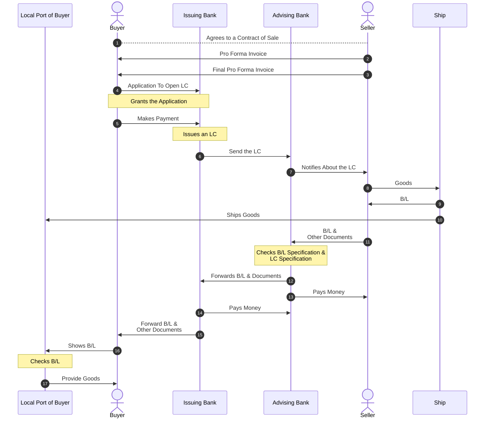

The following sequence diagram illustrates the step-by-step process of an LC
transaction, depicting the interactions between the buyer, seller, issuing and
advising banks, and shipping entities from the initial contract agreement to the
final delivery of goods at the buyer's local port.

