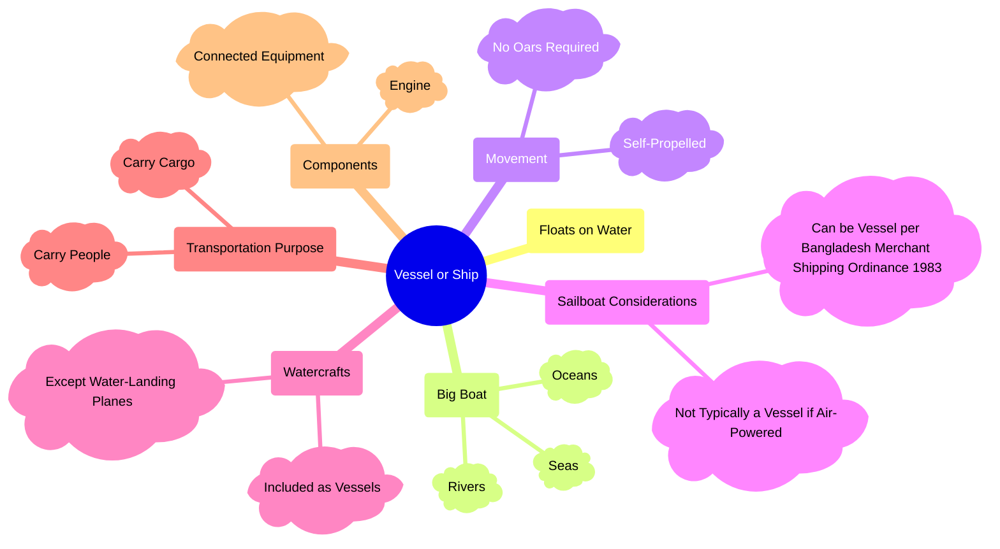

In Bangladesh, the classification of a vessel or ship extends beyond its basic
definition, encompassing various characteristics that determine its legal and
functional status. This mindmap outlines the scope and definition of traditional
vessels in Bangladesh, considering factors such as flotation, movement
mechanisms, and intended use. It highlights distinctions between large boats
operating in rivers, seas, and oceans, self-propelled vessels, and watercrafts-
including specific exceptions like water-landing planes. Additionally, it
addresses the role of sailboats under the Bangladesh Merchant Shipping Ordinance
of 1983 and the essential components that contribute to a vessel's operation.

