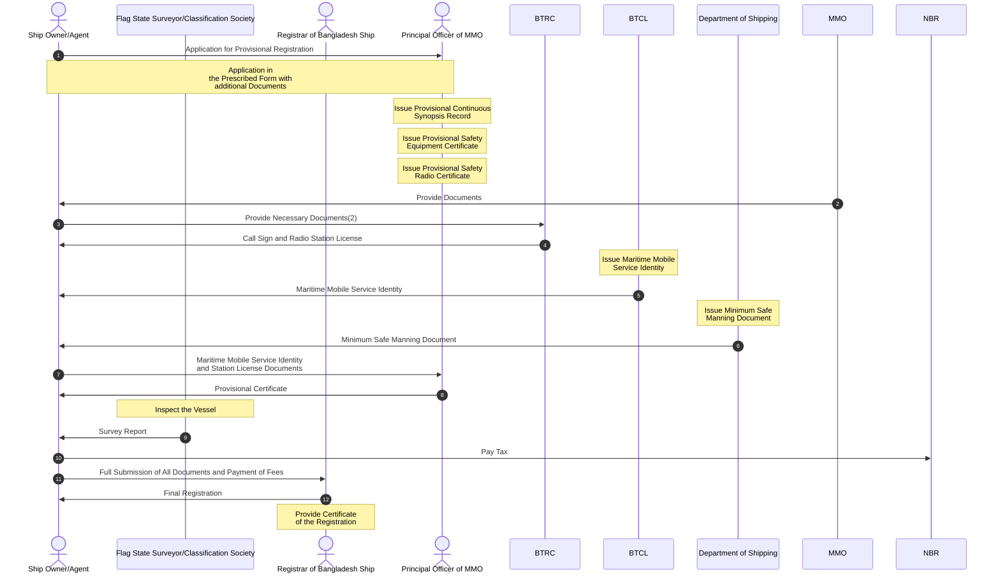

The following sequence diagram illustrates the process for provisional and final
registration of a ship in Bangladesh. It outlines the interactions and flow of
documents between the Ship Owner/Agent and various key entities, including the
Principal Officer of the Mercantile Marine Office (MMO), Bangladesh
Telecommunication Regulatory Commission (BTRC), Bangladesh Telecommunications
Company Limited (BTCL), the Department of Shipping, Flag State
Surveyor/Classification Society, the National Board of Revenue (NBR), and the
Registrar of Bangladesh Ship. The diagram details the steps involved, from the
initial application for provisional registration to the final issuance of the
Certificate of Registration.

